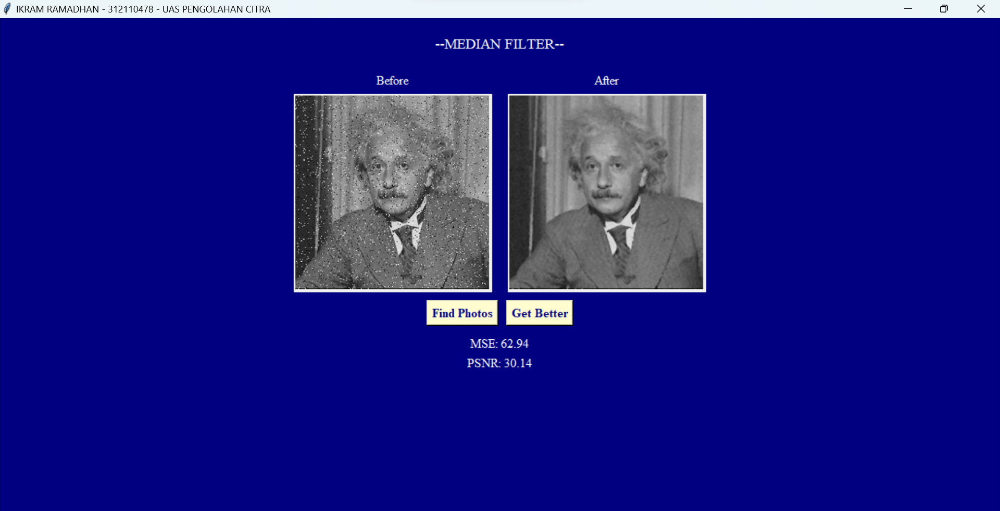

# UAS - PENGOLAHAN CITRA
```
Dosen Pengampu   : Muhammad Najamuddin Dwi Miharja, S.Kom, M.Kom
Mata Kuliah      : Pengolahan Citra
Nama             : Ikram Ramadhan
Nim              : 312110478
Kelas            : TI.21.C.1
```
#### Kode program Berikut adalah program median filter berbasis GUI bertujuan untuk memperbaiki citra sebuah gambar dengan menghilangkan noise pada gambar.
     
**Berikut penjelasan dari setiap bagian source code tersebut :**  
```
**Import Library :**

- tkinter: Library utama untuk membuat GUI.
- filedialog dari tkinter: Digunakan untuk menampilkan dialog file untuk memilih gambar.
- Image dari PIL (Python Imaging Library): Digunakan untuk memanipulasi gambar.
- numpy sebagai np: Digunakan untuk operasi matematika pada gambar.
- math: Digunakan untuk menghitung PSNR (Peak Signal-to-Noise Ratio).

**Fungsi**

- Fungsi calculate_mse(original, processed):

Menghitung Mean Squared Error (MSE) antara gambar asli dan gambar hasil pemrosesan.

- Fungsi calculate_psnr(mse, max_pixel=255.0):

Menghitung Peak Signal-to-Noise Ratio (PSNR) berdasarkan MSE.
Jika MSE = 0, mengembalikan nilai tak hingga (inf).

- Fungsi median_filter(image_array, filter_size):
**Class dan metode

Mengimplementasikan metode median filter untuk memproses gambar.
Menggunakan numpy untuk operasi array pada gambar.
Menggunakan operasi sliding window untuk mengambil tetangga piksel dan menghitung nilai median.

(class) Application yang merupakan turunan dari tkinter.Tk:

Mewarisi sifat-sifat dan metode dari kelas tkinter.Tk.
Digunakan untuk membuat aplikasi GUI.

(metode) Metode __init__(self):

Membuat jendela aplikasi dengan ukuran 600x350.

Mengatur judul jendela.

Mengatur latar belakang aplikasi menjadi navy.

Menginisialisasi atribut original_image dan processed_image dengan nilai None.

Membuat label judul aplikasi dengan font Times New Roman, ukuran 14, latar belakang navy, dan warna putih.

Mengatur tata letak frame untuk menampilkan gambar asli dan gambar hasil pemrosesan.

Membuat label dan canvas untuk menampilkan gambar asli dan gambar hasil pemrosesan.

Membuat frame untuk tombol-tombol dan label MSE serta PSNR.

Membuat tombol "Upload Image" dan "Process Image" dengan fungsi yang sesuai.

Membuat label MSE dan PSNR.

(Metode) upload_image(self):

Membuka jendela dialog untuk memilih file gambar.
Jika file dipilih, membuka gambar menggunakan PIL dan menampilkan gambar asli di canvas.

(Metode) process_image(self):

Memproses gambar menggunakan metode median filter.
Menghitung MSE dan PSNR antara gambar asli dan gambar hasil pemrosesan.
Menampilkan gambar hasil pemrosesan di canvas dan mengupdate nilai MSE dan PSNR pada label.

(Metode) display_image(self, canvas, image):

Menampilkan gambar di canvas dengan mengubah ukurannya menjadi 250x250 menggunakan PIL dan ImageTk.
Blok if __name__ == "__main__"::

Mengeksekusi aplikasi jika file ini dieksekusi langsung (bukan diimpor sebagai modul).
Membuat instance dari kelas Application dan memanggil metode mainloop() untuk menjalankan aplikasi.

```

* **Berikut adalah hasil dscreenshot program :**




* **Berikut adalah video/demo program :**

<div>
  
</div>


